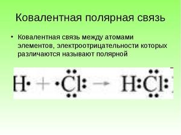
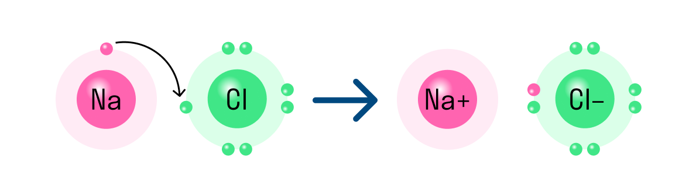

# Типы химической связи

## Ковалентная 

* Полярная 

*Это химическая связь между неметаллами с разной элекстроотрицательностью* 

* Неполярная 

*Это химическая связь между неметаллами с одинаковой элекстроотрицательностью*

## Ионная 

*Это химическая связь между металлом и не металлом*

**Не имеет значения в какой группе или переоде находиться металл и неметалл, элекстроотрицательность металла всегда будет на много меньше элекстроотрицательности неметалла**

## Исключения

1. Соли аммония 

**Ионная связь**

~~Ковалентно - полярная~~

2. Вода

**Ковалентно - полярная**

~~Водородная~~

# Классы веществ

* Оксиды

*химические соединения состоящие из кислорода и одного другого элемента*

* Соли 

*Химические соединения состоящие из металла и кислотного остатка*

